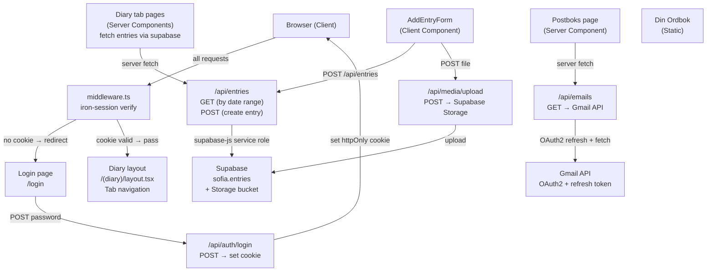

# feat: Build Diario — Personal Child Memory Book Web App

## Overview

Greenfield build of a personal child diary web app (Diario) — a curated digital memory book for a child's early years. The app presents memories (text, images, video) in a 70s botanical scrapbook aesthetic across six themed tabs. Built with Next.js 14 App Router, Tailwind CSS, Framer Motion (`motion` package), Supabase (Postgres + Storage), and deployed to Vercel.

**Critical architecture change from spec:** The Google Photos Library API (`photoslibrary.readonly` scope) was permanently removed on March 31, 2025 and is no longer accessible. The spec's Google Photos integration is replaced with Supabase Storage for all photo/video assets, uploaded directly through the add-entry form.

## Problem Frame

The author wants a handcrafted-feeling digital scrapbook for his child — not a generic photo app. The app must feel warm and nostalgic (polaroid photos, linen texture, botanical accents), be password-protected (private family content), and support ongoing diary entries with photos. It should also surface emails sent to the child's Gmail account (Postboks) as cute mail cards.

Origin: `SPEC.md` and `TEST_CASES.md` in project root.

## Requirements Trace

- R1. Single-password auth gates all content; session persists across refreshes
- R2. Six tabs render without page reload: four diary periods, Postboks, Din ordbok
- R3. Diary tabs show text entries from `sofia.entries` filtered by date range derived from birth date
- R4. Add-entry form (authenticated only) accepts date + text + optional media; saves immediately
- R5. Photos render as polaroid cards with random 2–4° tilt and spring-settle animation
- R6. Media (images/video) is uploaded to Supabase Storage via `/api/media/upload`
- R7. Postboks tab fetches and displays the 50 most recent emails to child's Gmail account
- R8. Din ordbok tab is a static placeholder page (no data)
- R9. All API routes verify the iron-session cookie — no unauthenticated access to private data
- R10. App is fully responsive (mobile: single-column stacked; desktop: asymmetric scrapbook collage)
- R11. 70s botanical scrapbook aesthetic: defined color palette, fonts, linen texture, botanical SVGs

## Scope Boundaries

- No Google Photos API integration (scope was permanently deprecated March 31, 2025)
- No vocabulary CRUD for Din ordbok (future integration with external vocabulary app)
- No OCR pipeline (one-time handwritten note import script — out of scope for this build)
- No user accounts, registration, or OAuth login for the diary owner
- No email sending from the app
- No public sharing of entries

### Deferred to Separate Tasks

- OCR migration script (Google Cloud Vision API, one-time local run): separate script, future iteration
- Din ordbok external app integration: future iteration when vocabulary app is ready
- Gmail Picker-based photo access (if owner later wants Google Photos in collage): future iteration

## Context & Research

### Relevant Code and Patterns

- Greenfield project. No existing implementation patterns. Research findings below are the sole basis.
- `SPEC.md` — full product specification (origin document)
- `TEST_CASES.md` — manual test checklist; all items must pass before deploy

### Institutional Learnings

- No `docs/solutions/` directory exists (first project). Notable learnings to capture during implementation:
  - Google Photos `photoslibrary.readonly` scope removed March 31, 2025 — do not use
  - Supabase custom schema requires dashboard exposure (Settings → API → Extra Search Path)
  - Next.js 14 `AnimatePresence` must live in `template.tsx`, not `layout.tsx`, for exit animations to fire
  - iron-session `SESSION_SECRET` must be 32+ characters (throws at runtime if shorter)

### External References

- [iron-session v8 docs](https://github.com/vvo/iron-session) — single-password cookie auth
- [motion package (Framer Motion renamed)](https://motion.dev) — `npm install motion`, import from `motion/react`
- [Supabase custom schemas guide](https://supabase.com/docs/guides/api/using-custom-schemas) — expose schema in dashboard
- [Gmail API users.messages.list](https://developers.google.com/gmail/api/reference/rest/v1/users.messages/list)
- [Gmail API users.messages.get](https://developers.google.com/gmail/api/reference/rest/v1/users.messages/get)
- [Next.js 14 Route Handlers](https://nextjs.org/docs/app/building-your-application/routing/route-handlers)
- [Google Photos deprecation notice](https://developers.google.com/photos/support/updates) — confirms scope removal

## Key Technical Decisions

- **Primary photo source: Supabase Storage**: `photoslibrary.readonly` was permanently removed March 31, 2025. Direct upload to Supabase Storage is the primary photo path. Same polaroid collage UX, different source.
- **Optional photo import: Google Photos Picker API**: The `photospicker.mediaitems.readonly` scope enables an interactive picker flow — user selects photos from their library in a browser popup; selected photos are downloaded server-side and re-uploaded to Supabase Storage for persistence. This adds Unit 11 (optional). Reference: https://github.com/savethepolarbears/google-photos-mcp (the MCP sidecar is not used directly in Vercel — the app calls the Picker REST API endpoints natively).
- **google-photos-mcp not used as a sidecar**: The MCP server requires a persistent Node.js sidecar process and local token storage — incompatible with Vercel's serverless architecture. The app integrates the Google Photos Picker API directly via Route Handlers.
- **iron-session over JWT**: Stateless httpOnly encrypted cookie. No session store, no complexity. 30-day TTL. Single `SESSION_SECRET` env var (32+ chars).
- **`motion` package**: Framer Motion was renamed to `motion` in 2025. New projects install `motion`, import from `motion/react`.
- **Tab dates derived from `BIRTH_DATE` env var**: Date ranges for all 4 diary tabs are computed server-side from `BIRTH_DATE` (ISO string). No `tab` column stored in DB — entries are filtered by `date BETWEEN tab_start AND tab_end`.
- **Server-only Supabase access**: All Supabase queries go through API Route Handlers using the service-role key. No client-side Supabase. No `NEXT_PUBLIC_*` Supabase env vars needed.
- **API-level auth**: Every Route Handler that returns private content calls `requireAuth()` before querying. Frontend gating is UI-only, not a security boundary.
- **No `sofia.used_photo_ids` table**: Without Google Photos, cross-tab photo deduplication is moot. Photos are attached to entries; an entry belongs to exactly one date range.
- **TypeScript throughout**: Catches API shape mismatches early, especially for the Gmail message payload parsing.
- **Supabase client**: `@supabase/supabase-js` only, using `createClient` with service-role key server-side. `@supabase/ssr` is not needed — that package is for Supabase-managed auth sessions; this app uses iron-session.
- **Gmail rate**: Fetch messages list, then fetch individual messages sequentially. For 50 messages this is acceptable for a personal app.
- **`template.tsx` for page transitions**: `layout.tsx` is persistent and won't re-render, so `AnimatePresence` exit animations require `template.tsx`.

## Open Questions

### Resolved During Planning

- **TypeScript?** Yes — idiomatic for Next.js 14, essential for Gmail MIME parsing.
- **Google Photos?** Primary: Supabase Storage (direct upload). Optional secondary: Google Photos Picker API (interactive browser flow; selected photos downloaded server-side and stored in Supabase Storage). The `photoslibrary.readonly` scope is permanently gone; the Picker is the only compliant mechanism for accessing personal library photos.
- **JWT vs session cookie?** iron-session — stateless encrypted cookie, no DB session store.
- **Birth date anchor?** `BIRTH_DATE` env var (ISO string, e.g., `"2024-03-15"`). Tab boundaries computed from it.
- **`tab` column semantics?** Removed — query uses `date BETWEEN` with computed boundaries.
- **API-level auth?** Yes — all routes verify iron-session cookie and return 401 if missing.
- **Media upload scope?** In scope — Supabase Storage via `/api/media/upload`.
- **Gmail pagination?** 50 most recent, newest-first, no pagination in v1.
- **Photo dedup?** Not needed — photos are attached to specific entries with a single date.
- **Mobile layout?** Single-column stacked, tilt preserved, photos above their entry text.

### Deferred to Implementation

- Exact Tailwind design token values (color hex codes, font size scale): discoverable when implementing design system
- Supabase Storage bucket configuration (public vs. signed URLs, RLS): resolve when setting up the bucket
- Gmail OAuth token refresh strategy details: implement and test when wiring the Gmail route handler
- Exact Framer Motion spring parameters for "settle" feel: tune during implementation

## Output Structure

```
diario/
├── app/
│   ├── layout.tsx                    # Root layout: fonts, global providers
│   ├── template.tsx                  # AnimatePresence page transitions
│   ├── page.tsx                      # Root → redirect to /de-forste-dagene
│   ├── login/
│   │   └── page.tsx                  # Password form
│   ├── (diary)/
│   │   ├── layout.tsx                # Tab navigation shell (authenticated)
│   │   ├── de-forste-dagene/page.tsx
│   │   ├── de-forste-ukene/page.tsx
│   │   ├── de-forste-maanedene/page.tsx
│   │   ├── de-forste-aarene/page.tsx
│   │   ├── postboks/page.tsx
│   │   └── din-ordbok/page.tsx
│   └── api/
│       ├── auth/
│       │   ├── login/route.ts
│       │   └── logout/route.ts
│       ├── entries/route.ts          # GET + POST diary entries
│       ├── media/
│       │   └── upload/route.ts       # POST → Supabase Storage
│       ├── emails/route.ts           # GET Gmail messages
│       └── photos/
│           └── picker/
│               ├── create/route.ts   # POST → create Picker session
│               └── [sessionId]/route.ts  # GET → poll session + download to Supabase
├── components/
│   ├── ui/
│   │   ├── TabNav.tsx
│   │   ├── DiaryEntry.tsx
│   │   ├── Polaroid.tsx
│   │   ├── PhotoCollage.tsx
│   │   ├── AddEntryForm.tsx
│   │   └── EmailCard.tsx
│   └── layout/
│       └── BotanicalBackground.tsx
├── lib/
│   ├── session.ts                    # iron-session config + SessionData type
│   ├── auth.ts                       # requireAuth() helper
│   ├── tabs.ts                       # Tab definitions + date range calculators
│   ├── supabase.ts                   # Server-only Supabase client
│   ├── gmail.ts                      # Gmail API client + message parser
│   └── google-picker.ts              # Google Photos Picker API client (Unit 11)
├── TOKENS.md                         # Token usage tracking (create at start of implementation)
├── public/
│   └── svgs/                         # Botanical SVG overlays (pressed flower, leaf)
├── styles/
│   └── globals.css
├── middleware.ts                     # Route protection
├── next.config.js
├── tailwind.config.ts
└── package.json
```

## High-Level Technical Design

> *This illustrates the intended approach and is directional guidance for review, not implementation specification. The implementing agent should treat it as context, not code to reproduce.*



## Implementation Units

### Phase 1: Foundation

- [ ] **Unit 1: Project Scaffold, Design System & Configuration**

**Goal:** Initialize the Next.js 14 TypeScript project with all dependencies, design token configuration, and the visual foundation (fonts, colors, botanical background).

**Requirements:** R11

**Dependencies:** None

**Files:**
- Create: `package.json`
- Create: `next.config.js`
- Create: `tailwind.config.ts`
- Create: `styles/globals.css`
- Create: `app/layout.tsx`
- Create: `public/svgs/botanical-1.svg`, `public/svgs/botanical-2.svg`, `public/svgs/botanical-3.svg`
- Create: `components/layout/BotanicalBackground.tsx`

**Approach:**
- `npm create next-app` with TypeScript, Tailwind, App Router
- Install: `motion`, `iron-session`, `@supabase/supabase-js`, `googleapis`, `google-auth-library`, `dompurify`, `@types/dompurify`
  - Note: `@supabase/ssr` is NOT installed — it is only needed for Supabase-managed auth session flows (cookie refresh middleware). This app uses iron-session for auth and service-role `createClient` for all DB access; there is no Supabase auth cookie to manage.
- Tailwind config: extend with palette (dusty rose `#D4A5A5`, sage green `#8FAF8A`, terracotta `#C4674A`, cream `#F5EFE0`, warm amber `#C8944A`), font families (playfair-display, dm-serif-text, caveat)
- Load Google Fonts via `next/font/google` in `app/layout.tsx`: Playfair Display (display), DM Serif Text (body), Caveat (handwritten)
- Global CSS: linen texture via CSS background-image (SVG data URI or image import), CSS custom properties for the palette, `@layer base` typography defaults
- `BotanicalBackground.tsx`: renders 3–4 botanical SVG overlays as fixed `position: absolute` elements at page edges, low opacity (10–20%), pointer-events: none
- `next.config.js`: allowedDevOrigins for local dev, `images.remotePatterns` for Supabase Storage hostname

**Patterns to follow:** Next.js 14 App Router conventions; `next/font/google` for font loading (no FOUT)

**Test scenarios:**
- Test expectation: none — this unit is scaffolding and visual configuration, no behavioral logic to test at this stage. Visual output verified manually: correct font families load, correct colors appear, botanical SVGs overlay at low opacity on all pages.

**Verification:**
- `npm run dev` starts without errors
- Fonts render correctly in browser
- Color palette and botanical SVG background visible
- No TypeScript errors on scaffold

---

- [ ] **Unit 2: Supabase Schema Migration & Data Layer**

**Goal:** Create the `sofia` schema in Supabase with the `entries` table and configure Supabase Storage for media uploads. Set up the server-side Supabase client.

**Requirements:** R3, R4, R6

**Dependencies:** Unit 1 (package.json with `@supabase/supabase-js` + `@supabase/ssr`)

**Files:**
- Create: `supabase/migrations/001_sofia_schema.sql`
- Create: `lib/supabase.ts`

**Approach:**
- SQL migration creates schema `sofia`, grants access to `service_role`, creates `entries` table:
  ```
  sofia.entries:
    id          uuid DEFAULT gen_random_uuid() PRIMARY KEY
    date        date NOT NULL
    text        text
    media_urls  text[] DEFAULT '{}'
    created_at  timestamptz DEFAULT now()
  ```
- Supabase dashboard: add `sofia` to Settings → API → Extra Search Path (manual step, documented in unit)
- Create a Storage bucket named `diario-media` (public read or signed URL — resolve at implementation time; public is simpler for a private app behind auth)
- `lib/supabase.ts`: creates a Supabase client using `createClient` from `@supabase/supabase-js` with service-role key and `db: { schema: 'sofia' }`. This is a server-only module (no `NEXT_PUBLIC_` env vars). Export as `supabaseAdmin`.
- Env vars required: `SUPABASE_URL`, `SUPABASE_SERVICE_ROLE_KEY`, `SUPABASE_STORAGE_BUCKET`
- No `NEXT_PUBLIC_` Supabase env vars are needed — all Supabase access is server-side only
- Supabase Storage bucket `diario-media`: configure as **public read** (no signed URLs). The accepted risk is documented in Risks & Dependencies — URLs are UUID-based and unguessable; the app is behind a password gate. This resolves the implementation-time decision.

**Patterns to follow:** Supabase custom schema guide; service-role-only server client pattern

**Test scenarios:**
- Happy path: `supabaseAdmin.from('entries').select('*')` returns an empty array (not an error) when schema and grants are configured correctly
- Integration: insert a row into `sofia.entries` via `supabaseAdmin`, then query it back — row is returned with correct shape
- Error: missing `sofia` schema exposure in dashboard causes `404` from PostgREST — verify configuration step prevents this

**Verification:**
- SQL migration runs without errors in Supabase SQL editor
- `sofia.entries` table exists with correct columns
- `diario-media` Storage bucket created
- Test query via Supabase client returns data (not permission error)

---

- [ ] **Unit 3: Auth Layer — iron-session + Middleware**

**Goal:** Implement the full authentication system: login/logout API routes, iron-session config, session verification helper, and middleware that protects all routes except `/login`.

**Requirements:** R1, R9

**Dependencies:** Unit 1 (package.json with `iron-session`)

**Files:**
- Create: `lib/session.ts`
- Create: `lib/auth.ts`
- Create: `app/api/auth/login/route.ts`
- Create: `app/api/auth/logout/route.ts`
- Create: `middleware.ts`
- Create: `app/login/page.tsx`
- Test: `__tests__/auth.test.ts`

**Approach:**
- `lib/session.ts`: exports `SessionData` interface (`{ isLoggedIn: boolean }`) and `sessionOptions` (cookieName `'diario-session'`, password from `SESSION_SECRET` env var, httpOnly, secure in production, **sameSite: 'strict'** — not 'lax'; Strict eliminates CSRF on POST endpoints without requiring CSRF tokens, and the app is bookmarked directly, not navigated to from external links, 30-day maxAge)
- `lib/auth.ts`: exports `requireAuth(cookies)` — calls `getIronSession`, checks `isLoggedIn`, **returns** `NextResponse.json({ error: 'Unauthorized' }, { status: 401 })` if false (does NOT throw; callers must early-return the result). Called as the first statement in every protected Route Handler: `const authCheck = await requireAuth(cookies()); if (authCheck) return authCheck;`
- `app/api/auth/login/route.ts`: POST — reads `{ password }` from JSON body, compares to `APP_PASSWORD` env var with `crypto.timingSafeEqual` (prevent timing attacks), sets iron-session on success, returns 401 on failure
- `app/api/auth/logout/route.ts`: POST — destroys session, returns 200
- `middleware.ts`: reads iron-session from request cookies; redirects to `/login` if not authenticated. Excludes `/login`, `/api/auth/**`, and static assets from the check. Uses `matcher` with `missing` array to skip Next.js prefetch requests.
- `app/login/page.tsx`: client component with password input, submit → `POST /api/auth/login`, redirects to `/` on success, shows error on 401

**Patterns to follow:** iron-session v8 App Router pattern; `crypto.timingSafeEqual` for password comparison

**Test scenarios:**
- Happy path: POST `/api/auth/login` with correct password → 200, `Set-Cookie` header present with `diario-session`
- Happy path: subsequent request to `/api/entries` with valid cookie → 200 (not 401)
- Happy path: POST `/api/auth/logout` → 200, cookie cleared
- Error: POST login with wrong password → 401 with error body
- Edge case: POST login with missing `password` field → 401 or 400
- Edge case: request to protected route without cookie → 302 redirect to `/login`
- Edge case: cookie present but corrupted/tampered (iron-session HMAC detects this) → 401 or redirect to `/login`
- Edge case: `requireAuth()` return value is passed back from Route Handler without executing further code — no Supabase query runs on unauthorized request
- Integration: login → access protected page → logout → access protected page again → redirect to login

**Verification:**
- Correct password grants access; wrong password is rejected with clear error message
- Session cookie is httpOnly, Secure (production), **SameSite=Strict**
- Middleware redirects unauthenticated requests to `/login`
- Logout clears the session and subsequent protected requests are denied

---

### Phase 2: Core Diary Features

- [ ] **Unit 4: Tab System, Date Range Logic & Navigation Shell**

**Goal:** Define the six tabs with their date range calculators (derived from `BIRTH_DATE` env var), implement the tab navigation UI, and build the authenticated diary layout shell.

**Requirements:** R2, R3

**Dependencies:** Unit 3 (auth), Unit 1 (design system)

**Files:**
- Create: `lib/tabs.ts`
- Create: `app/(diary)/layout.tsx`
- Create: `components/ui/TabNav.tsx`
- Create: `app/page.tsx` (redirect to first diary tab)
- Create: `app/(diary)/de-forste-dagene/page.tsx` (stub)
- Create: `app/(diary)/de-forste-ukene/page.tsx` (stub)
- Create: `app/(diary)/de-forste-maanedene/page.tsx` (stub)
- Create: `app/(diary)/de-forste-aarene/page.tsx` (stub)
- Create: `app/(diary)/postboks/page.tsx` (stub)
- Create: `app/(diary)/din-ordbok/page.tsx` (stub)
- Test: `__tests__/tabs.test.ts`

**Approach:**
- `lib/tabs.ts`: exports `TAB_DEFINITIONS` — an array of tab config objects:
  ```
  { key, href, label, getDateRange(birthDate: Date): { from: Date; to: Date } }
  ```
  Date ranges:
  - De første dagene: day 0 → day 14
  - De første ukene: day 14 → day 56 (week 8 end)
  - De første månedene: day 56 → day 365 (12 months)
  - De første årene: day 365 → day 1825 (5 years)
  - Postboks and Din ordbok have no date range
  - Exports `getBirthDate()` — reads `BIRTH_DATE` env var and parses to `Date`; throws if missing or invalid
- `app/(diary)/layout.tsx`: server component, calls `requireAuth`, renders `TabNav` + `{children}` wrapped in the botanical layout shell. Fetches birth date for tab date range display.
- `components/ui/TabNav.tsx`: client component, renders 6 tab buttons, uses `usePathname()` for active state, styled with the warm palette (active: terracotta, inactive: sage/cream)
- `app/page.tsx`: redirect to `/de-forste-dagene`

**Patterns to follow:** Next.js App Router route groups; `usePathname` for active tab; server component layout with client component child

**Test scenarios:**
- Happy path: `getDateRange('de-forste-dagene', new Date('2024-03-15'))` → `{ from: 2024-03-15, to: 2024-03-29 }` (14 days)
- Happy path: `getDateRange('de-forste-ukene', new Date('2024-03-15'))` → from day 14 to day 56
- Happy path: `getDateRange('de-forste-aarene', new Date('2024-03-15'))` → from day 365 to day 1825
- Edge case: birth date is February 29 (leap year) — verify no crashes on date arithmetic
- Edge case: `BIRTH_DATE` env var missing — `getBirthDate()` throws a clear error message
- Edge case: `BIRTH_DATE` value is not a valid ISO date — throws clear error
- Integration: tab navigation clicks change the active route without full page reload

**Verification:**
- All 6 tabs render and switch without page reload
- Active tab is visually distinct
- Date ranges are correct for a known birth date
- Unauthenticated access redirects to `/login`

---

- [ ] **Unit 5: Diary Entry API & Display**

**Goal:** Implement `GET` and `POST` for `/api/entries`, and build the diary tab pages that fetch and display entries in chronological order.

**Requirements:** R3, R4

**Dependencies:** Unit 2 (Supabase schema), Unit 3 (auth), Unit 4 (tab date ranges)

**Files:**
- Create: `app/api/entries/route.ts`
- Modify: `app/(diary)/de-forste-dagene/page.tsx` (full implementation)
- Modify: `app/(diary)/de-forste-ukene/page.tsx`
- Modify: `app/(diary)/de-forste-maanedene/page.tsx`
- Modify: `app/(diary)/de-forste-aarene/page.tsx`
- Create: `components/ui/DiaryEntry.tsx`
- Test: `__tests__/api-entries.test.ts`

**Approach:**
- `app/api/entries/route.ts`:
  - `GET`: requires auth cookie; reads `?tab=<key>` query param; looks up date range for the tab using `getBirthDate()` + `TAB_DEFINITIONS`; queries `sofia.entries WHERE date BETWEEN from AND to ORDER BY date ASC`; returns JSON array
  - `POST`: requires auth cookie; reads `{ date, text, media_urls }` from body; validates date falls within one of the four diary tab ranges; validates `text` is non-empty or `media_urls` is non-empty; inserts row; returns created entry as JSON
- Diary tab pages are **Server Components** that query Supabase **directly via `supabaseAdmin`** (not via `fetch('/api/entries')` — direct DB call avoids an unnecessary HTTP roundtrip in SSR). Each page: (1) gets the tab's date range from `TAB_DEFINITIONS`, (2) calls `supabaseAdmin.from('entries').select('*').gte('date', from).lte('date', to).order('date', { ascending: true })`, (3) renders a list of `DiaryEntry` components, (4) renders a `{children}` slot or empty `<div>` as a placeholder where `PhotoCollage` will be injected in Unit 7, (5) renders an `AddEntryForm` trigger (Unit 6).
- `components/ui/DiaryEntry.tsx`: displays `date` (Caveat font), `text` (body font), and any `media_urls` as thumbnails (inline images, not polaroids — polaroids are for the collage layer). Empty state: a soft illustrated message ("Ingen minner enda...").

**Patterns to follow:** Next.js 14 Route Handler; direct Supabase query in Server Component; Tailwind typography for entry text

**Test scenarios:**
- Happy path: GET `/api/entries?tab=de-forste-dagene` with valid cookie → returns array of entries in date range, ordered by date ascending
- Happy path: POST `/api/entries` with valid date + text → 201, response body contains the new entry with generated `id` and `created_at`
- Edge case: GET when no entries exist for tab → returns `[]` (not error)
- Edge case: POST with `date` outside any valid diary tab range → 400 with descriptive error
- Edge case: POST with empty `text` AND empty `media_urls` → 400
- Error: GET without auth cookie → 401
- Error: POST without auth cookie → 401
- Integration: POST entry → GET entries for same tab → new entry appears in list with correct date ordering

**Verification:**
- Each diary tab only shows entries within its date range
- Entries render in chronological order with correct date labels
- Empty state renders gracefully when no entries exist
- POST creates an entry and the response contains the created row

---

- [ ] **Unit 6: Add Entry Form & Media Upload**

**Goal:** Build the authenticated "Add entry" form with date picker, rich text input, and optional media upload to Supabase Storage.

**Requirements:** R4, R6

**Dependencies:** Unit 2 (Supabase Storage), Unit 3 (auth), Unit 4 (tab date ranges)

**Files:**
- Create: `app/api/media/upload/route.ts`
- Create: `components/ui/AddEntryForm.tsx`
- Modify: diary tab pages (integrate `AddEntryForm`)
- Test: `__tests__/api-media.test.ts`

**Approach:**
- `app/api/media/upload/route.ts`: POST — requires auth cookie; reads multipart form data; validates file using **magic-byte inspection** (not client-supplied Content-Type, which is spoofable): reads first 12 bytes and matches against known image/video signatures (JPEG: `FF D8 FF`; PNG: `89 50 4E 47`; GIF: `47 49 46`; MP4: `66 74 79 70` at offset 4; MOV: `6D 6F 6F 76` at offset 4). **Reject SVG and HTML files unconditionally** (prevent stored XSS via Supabase Storage CDN). Validates size under 50MB. Generates a UUID-based filename (not derived from original filename). Uploads to Supabase Storage `diario-media` bucket; returns `{ url: string }` with the public URL.
- `components/ui/AddEntryForm.tsx`: client component (needs `useState` for form state):
  - The `app/(diary)/layout.tsx` Server Component reads the iron-session and passes `isAuthenticated: boolean` as a prop to diary tab pages; those pages pass it down to `AddEntryForm`. This is the single prescribed mechanism — no client-side cookie reading needed.
  - Rendered inside a modal/drawer toggle. The "Add entry" button and form are only rendered when `isAuthenticated === true`. When `false`, the button is not in the DOM at all.
  - Date picker: `<input type="date">` constrained with `min` and `max` attributes derived from the current tab's date range (passed as `{ minDate, maxDate }` props from the diary page)
  - Text area: plain `<textarea>` with comfortable sizing
  - File input: accepts `image/*,video/*`; on change, uploads immediately to `/api/media/upload` and stores returned URLs in component state
  - On submit: POST to `/api/entries` with `{ date, text, media_urls }`; on success: calls `onSuccess(newEntry)` callback (parent optimistically prepends the new entry using the response body); on error: shows inline error message; form remains open on error

**Patterns to follow:** Next.js multipart form data handling in Route Handler; Supabase Storage upload with service-role key; controlled form with optimistic update

**Test scenarios:**
- Happy path: POST `/api/media/upload` with valid JPEG → 200, returns `{ url: "https://..." }`
- Happy path: form submit with date + text → POST `/api/entries` → entry appears in list without page reload
- Happy path: form submit with date + text + uploaded image → entry appears with image
- Edge case: upload file where Content-Type claims `image/jpeg` but magic bytes indicate HTML → 400 (type bypass rejected)
- Edge case: upload SVG file → 400 unconditionally (SVG can contain `<script>` tags and execute XSS via CDN URL)
- Edge case: upload file over 50MB → 413 or 400
- Edge case: submit with date outside tab's range → 400 from API, inline error shown in form
- Edge case: submit with no text and no media → form validation prevents submit (or API returns 400)
- Error: upload without auth cookie → 401
- Error: POST entries without auth cookie → 401
- Integration: upload image → URL returned → submit entry with URL → entry with image renders in collage

**Verification:**
- "Add entry" button is hidden when not authenticated
- Date picker is constrained to the current tab's date range
- Form submits and new entry appears immediately
- Uploaded files are accessible via the returned URL
- On error, form stays open with message; no partial state corruption

---

### Phase 3: Visual Collage Layer

- [ ] **Unit 7: Polaroid Collage Component & Framer Motion Animations**

**Goal:** Build the polaroid photo card component with spring-settle animation and the asymmetric scrapbook collage layout that scatters photo polaroids across the diary page.

**Requirements:** R5, R11

**Dependencies:** Unit 1 (design system), Unit 5 (entries data with media_urls)

**Files:**
- Create: `components/ui/Polaroid.tsx`
- Create: `components/ui/PhotoCollage.tsx`
- Modify: `app/(diary)/de-forste-dagene/page.tsx` (replace placeholder div with `PhotoCollage`)
- Modify: `app/(diary)/de-forste-ukene/page.tsx`
- Modify: `app/(diary)/de-forste-maanedene/page.tsx`
- Modify: `app/(diary)/de-forste-aarene/page.tsx`
- Test: `__tests__/polaroid.test.ts`

**Approach:**
- `components/ui/Polaroid.tsx`: `'use client'` directive; receives `src`, `caption`, `index` props
  - Spring-settle animation: `motion.div` with `initial={{ rotate: 0, y: -20, opacity: 0 }}` and `animate={{ rotate: targetRotation, y: 0, opacity: 1 }}`. Spring config for rotate: `stiffness: 60, damping: 12, mass: 1.2, delay: index * 0.08`. The `targetRotation` is a deterministic value derived from `index` — range `-8deg` to `+8deg` (e.g., `((index % 7) - 3) * 2.5`).
  - Visual: white `bg-white` card, `p-3 pb-10` (polaroid bottom margin for caption space), `shadow-lg`, `overflow-hidden` for image corners; `next/image` for lazy loading. Caption below in Caveat font.
  - Hover: `whileHover={{ scale: 1.05, zIndex: 10 }}`
- `components/ui/PhotoCollage.tsx`: receives all photos across all entries for the current tab (flattened list of `{ url, caption, date }` objects). Renders polaroids in a `relative` container with `absolute` positioning to break grid layout. Each polaroid gets a position calculated from its index (alternating left/right columns, varied vertical spacing) — not CSS grid. Generous whitespace, photos may overlap slightly.
- On mobile (< 768px): polaroids stack vertically with no overlap, tilt preserved

**Patterns to follow:** `motion.div` from `motion/react`; `next/image` with `fill` in sized container; CSS absolute positioning for scrapbook scatter

**Test scenarios:**
- Happy path: `Polaroid` renders with an image and caption visible
- Happy path: `Polaroid` animation fires on mount (rotation spring settles to target angle)
- Happy path: multiple polaroids in `PhotoCollage` render at different angles and positions (not a uniform grid)
- Edge case: no photos → `PhotoCollage` renders nothing (no crash, no empty div visible)
- Edge case: single photo → renders centered without layout errors
- Edge case: `index = 0` → `targetRotation` is deterministic and within range

**Verification:**
- Photos animate on load with spring settle (wobble then stop)
- No photo renders at 0° tilt (would look broken, not scrapbook)
- Collage layout is asymmetric on desktop and stacked on mobile
- Photos load lazily (visible in Chrome DevTools network waterfall)

---

### Phase 4: Integrations

- [ ] **Unit 8: Postboks — Gmail API Integration**

**Goal:** Implement the Gmail Route Handler that fetches the 50 most recent emails to the child's account, and build the Postboks tab page with expandable email cards.

**Requirements:** R7

**Dependencies:** Unit 3 (auth), Unit 1 (design system)

**Files:**
- Create: `lib/gmail.ts`
- Create: `app/api/emails/route.ts`
- Modify: `app/(diary)/postboks/page.tsx`
- Create: `components/ui/EmailCard.tsx`
- Test: `__tests__/gmail.test.ts`

**Approach:**
- `lib/gmail.ts`:
  - `getGmailClient()`: creates a Google OAuth2 client with `GOOGLE_CLIENT_ID`, `GOOGLE_CLIENT_SECRET`, sets `refresh_token` from `GMAIL_REFRESH_TOKEN`. Returns authenticated Gmail client via `google.gmail({ version: 'v1', auth })`.
  - `fetchEmails(toAddress: string)`: calls `users.messages.list` with query `to:{GMAIL_TO_ADDRESS}`, `maxResults: 50`, sorted newest-first. Then fetches each message with `users.messages.get({ id, format: 'full' })`. Parses headers (From, Subject, Date) and decodes body (recursive MIME part extractor, `Buffer.from(data, 'base64url')`). Returns typed array of `EmailMessage` objects.
  - `GMAIL_TO_ADDRESS` env var: the child's email address (used as the `to:` filter)
  - On `invalid_grant` error from Google: returns empty array with a logged warning rather than crashing
- `app/api/emails/route.ts`: GET — requires auth cookie; calls `fetchEmails`; returns JSON array. On Gmail API failure: returns `{ emails: [], error: 'Gmail unavailable' }` (graceful fallback, 200 not 500).
- `app/(diary)/postboks/page.tsx`: server component that fetches `/api/emails`; passes data to `EmailCard` list. Empty state when `emails.length === 0`.
- `components/ui/EmailCard.tsx`: client component with `useState` for expanded/collapsed state. Collapsed: sender avatar (first letter), sender name, date, subject, snippet. Expanded on click: full body — **if HTML body, sanitize with DOMPurify (import from `dompurify`) before rendering via `dangerouslySetInnerHTML`**; DOMPurify strips all `<script>` tags, inline event handlers (`onerror`, `onclick`, etc.), and `javascript:` hrefs. Prefer `text/html` over `text/plain` when both are available. Styled in soft pastels, handcrafted look — not a raw email client.
- Env vars: `GOOGLE_CLIENT_ID`, `GOOGLE_CLIENT_SECRET`, `GMAIL_REFRESH_TOKEN`, `GMAIL_TO_ADDRESS`

**Patterns to follow:** `googleapis` Node.js client; recursive MIME body extractor; graceful API fallback pattern

**Test scenarios:**
- Happy path: GET `/api/emails` with valid cookie → returns array of 50 emails (or fewer if inbox has fewer), each with `from`, `subject`, `date`, `body` fields
- Happy path: email with `multipart/alternative` body → `text/html` extracted correctly
- Happy path: email with direct `text/plain` body (no `parts`) → body extracted from `payload.body.data`
- Edge case: empty inbox → returns `{ emails: [] }`, Postboks page shows empty state
- Edge case: Gmail refresh token expired (`invalid_grant`) → returns empty array with log, no 500
- Error: GET without auth cookie → 401
- Integration: base64url decoding → decoded body contains correct UTF-8 text (test with a known fixture)
- **Security**: email body containing `<script>alert(1)</script>` is rendered with script stripped (DOMPurify sanitization applied before `dangerouslySetInnerHTML`)
- **Security**: email body with `` is rendered with the `onerror` attribute removed

**Verification:**
- Emails are fetched and rendered as card list
- Clicking an email expands the full body
- Empty state renders correctly
- API returns 200 with empty array (not 500) when Gmail is unavailable

---

- [ ] **Unit 9: Din Ordbok Static Placeholder**

**Goal:** Build the Din ordbok tab as a styled placeholder page that signals the feature is coming without broken UI.

**Requirements:** R2 (tab renders), R8

**Dependencies:** Unit 4 (tab shell)

**Files:**
- Modify: `app/(diary)/din-ordbok/page.tsx`

**Approach:**
- Server component (no data fetching)
- Renders a warm placeholder: a decorative heading ("Din ordbok"), a short message ("Ordene dine venter... Snart her!"), and a botanical accent SVG. Styled consistently with the scrapbook aesthetic.
- No broken links, no API calls, no missing assets.

**Test scenarios:**
- Test expectation: none — static markup only. Visual verification: page renders without errors or broken elements.

**Verification:**
- Page renders without JavaScript errors
- No broken image or SVG imports
- Consistent with the design system (correct fonts, colors)

---

### Phase 5: Polish & Transitions

- [ ] **Unit 10: Page Transitions, Mobile Layout & Design Polish**

**Goal:** Wire up Framer Motion page transitions between tabs, implement the mobile-responsive layout, and apply final design polish (botanical background, full color palette, font hierarchy).

**Requirements:** R10, R11

**Dependencies:** All previous units

**Files:**
- Create: `app/template.tsx`
- Modify: `app/layout.tsx`
- Modify: `tailwind.config.ts` (finalize breakpoints and custom utilities)
- Modify: `components/layout/BotanicalBackground.tsx` (final SVG placement)
- Modify: `styles/globals.css` (linen texture, final typography defaults)

**Approach:**
- `app/template.tsx`: `'use client'` — wraps children in `AnimatePresence mode="wait"` + `motion.div` keyed by pathname. Fade-slide transition: `initial={{ opacity: 0, x: 16 }}`, `animate={{ opacity: 1, x: 0 }}`, `exit={{ opacity: 0, x: -16 }}`. Spring transition: `stiffness: 300, damping: 30`. **FrozenRouter pattern**: if during implementation the exit animation shows the new tab's content (not the exiting tab), wrap children in a `FrozenRouter` component that captures the current `LayoutRouterContext` via `useContext` and freezes it with `useRef` so the exiting tab does not re-render with the new route's data. Import the context from `next/dist/shared/lib/app-router-context.shared-runtime`. This is only needed if the flash-of-wrong-content bug occurs — implement it conditionally during testing.
- Mobile layout: at `< md` breakpoint, `PhotoCollage` switches to vertical stacking (CSS class applied via Tailwind `md:` prefix). `TabNav` becomes a horizontal scroll or bottom tab bar. Entry text and photos stack vertically.
- Final design tokens: confirm all palette values, add CSS custom properties for consistent usage across components, verify font hierarchy renders correctly (Playfair for headings, DM Serif for body, Caveat for dates and captions)
- Botanical background: 3 SVG elements at corners/edges with `z-index: 0`, `pointer-events: none`, `opacity: 0.12`. Main content on `z-index: 10`.
- Verify TEST_CASES.md checklist items for Design / UI section pass

**Patterns to follow:** `app/template.tsx` pattern (not `layout.tsx`) for `AnimatePresence`; `FrozenRouter` pattern if route exit animations show wrong-route content

**Test scenarios:**
- Test expectation: none — UI polish and animation. Visual verification: photos animate on load; page fade-slide fires between tabs; mobile layout stacks cleanly on a 375px viewport.

**Verification:**
- Tab switches produce fade-slide animation (not instant swap)
- App is fully usable on 375px width (no horizontal scroll, no overflow)
- All `TEST_CASES.md` Design / UI checklist items pass on visual inspection

---

### Phase 6: Optional Enhancement

- [ ] **Unit 11: Google Photos Picker Import**

**Goal:** Add an optional "Import from Google Photos" flow in the add-entry form that lets the owner select photos from their personal Google Photos library via the interactive Picker API, downloads them server-side, and stores them in Supabase Storage.

**Requirements:** R4 (extends media sources), R6 (all photos end up in Supabase Storage)

**Dependencies:** Unit 6 (AddEntryForm + `/api/media/upload`), Unit 3 (auth)

**Files:**
- Create: `app/api/photos/picker/create/route.ts`
- Create: `app/api/photos/picker/[sessionId]/route.ts`
- Create: `lib/google-picker.ts`
- Modify: `components/ui/AddEntryForm.tsx` (add "Import from Google Photos" button)
- Modify: `next.config.js` (add Google Picker API domain to CSP if needed)
- Test: `__tests__/api-photos-picker.test.ts`

**Approach:**
- `lib/google-picker.ts`: wraps the Google Photos Picker API. Creates picker sessions via `POST https://photospicker.googleapis.com/v1/sessions`, polls sessions via `GET https://photospicker.googleapis.com/v1/sessions/{sessionId}`, fetches selected media items via `GET https://photospicker.googleapis.com/v1/mediaItems?sessionId={id}&pageToken={token}`. Uses `GOOGLE_PICKER_REFRESH_TOKEN` + `GOOGLE_CLIENT_ID` + `GOOGLE_CLIENT_SECRET` to obtain access tokens. Scope: `https://www.googleapis.com/auth/photospicker.mediaitems.readonly`.
- `app/api/photos/picker/create/route.ts`: POST — requires auth; creates a Picker session; returns `{ sessionId, pickerUri }` to the client. The client opens `pickerUri` in a new tab or popup window.
- `app/api/photos/picker/[sessionId]/route.ts`: GET — requires auth; polls the session for completion; when `mediaItemsSet: true`, fetches media items, downloads each photo's `baseUrl + "=w1600"` server-side (via `fetch`), re-uploads to Supabase Storage via `supabaseAdmin.storage.from(bucket).upload(...)`, returns array of permanent Supabase Storage URLs. Deletes the picker session when done.
- `components/ui/AddEntryForm.tsx`: adds an "Import from Google Photos" button next to the file upload input. On click: calls `/api/photos/picker/create`, opens the returned `pickerUri` in a new browser tab, then begins polling `/api/photos/picker/{sessionId}` every 3 seconds until `mediaItemsSet: true` (or timeout after 5 minutes). When photos arrive, appends their Supabase Storage URLs to `media_urls` form state.
- `GOOGLE_PICKER_REFRESH_TOKEN` env var: a separate pre-authorized refresh token for the Picker scope. Can use the same Google Cloud OAuth client as Gmail, but requires a separate auth flow for the `photospicker.mediaitems.readonly` scope.
- **Fallback:** if `GOOGLE_PICKER_REFRESH_TOKEN` is not set, the "Import from Google Photos" button is not rendered. Feature degrades gracefully — direct upload still works.

**Patterns to follow:** Same token refresh pattern as `lib/gmail.ts`; same Supabase Storage upload pattern as `/api/media/upload`

**Test scenarios:**
- Happy path: POST `/api/photos/picker/create` with valid cookie → returns `{ sessionId, pickerUri }` where `pickerUri` is a valid Google URL
- Happy path: GET `/api/photos/picker/{sessionId}` when session is complete (`mediaItemsSet: true`) → returns array of Supabase Storage URLs
- Edge case: GET `/api/photos/picker/{sessionId}` when user hasn't finished selecting yet → returns `{ ready: false }` (not an error)
- Edge case: GET `/api/photos/picker/{sessionId}` when 5 minutes have elapsed without completion → returns 408 timeout
- Edge case: `GOOGLE_PICKER_REFRESH_TOKEN` not set in env → POST to create returns 501 with clear message; "Import from Google Photos" button is not rendered in the form
- Error: POST create without auth cookie → 401
- Error: Google Picker API unreachable (network failure) → 503 with fallback message
- Integration: full flow — create session → (simulate) mark session complete → poll → downloaded photo URLs appear in Supabase Storage and are returned

**Verification:**
- "Import from Google Photos" button visible in AddEntryForm when `GOOGLE_PICKER_REFRESH_TOKEN` env var is set
- Button is absent (not rendered) when env var is not set
- Picker flow creates a session and returns a valid Google `pickerUri`
- Polled session returns permanent Supabase Storage URLs (not expiring Google `baseUrl` values)
- Photos from Picker flow render in the same polaroid collage as directly uploaded photos

---

## System-Wide Impact

- **Interaction graph:** All four diary tab pages depend on the same `/api/entries` Route Handler. The `AddEntryForm` writes to the same table. The `Supabase` module is shared across `lib/supabase.ts`. Auth is checked in every Route Handler via `lib/auth.ts`.
- **Error propagation:** API Route Handlers catch Supabase errors and return structured JSON error responses (not raw DB errors). Gmail failures return empty arrays with 200 (graceful fallback, per spec). Auth failures return 401. Invalid input returns 400. All 5xx errors should be logged server-side.
- **State lifecycle risks:** Optimistic UI in `AddEntryForm` — if POST succeeds but the optimistic entry has a wrong date, the displayed entry may appear in the wrong visual position. Mitigate: use the API response body (not the pre-submit state) as the source of truth for the new entry.
- **API surface parity:** All four `/api/*` routes must independently verify the iron-session cookie. The middleware protects page routes; Route Handlers are not automatically covered by middleware in Next.js.
- **Integration coverage:** The unit tests alone cannot verify that a `POST /api/entries` followed by a `GET /api/entries` for the correct tab returns the new entry — this cross-route integration needs explicit coverage in `__tests__/api-entries.test.ts`.
- **Unchanged invariants:** The `sofia` Postgres schema is the only database used. No `public` schema tables are created by this app. All DB calls go through `lib/supabase.ts` (the service-role admin client).
- **`template.tsx` internal import risk:** The `FrozenRouter` pattern uses `next/dist/shared/lib/app-router-context.shared-runtime` — an internal Next.js import. Pin the Next.js minor version in `package.json` to avoid breakage on minor upgrades.

## Risks & Dependencies

| Risk | Mitigation |
|------|------------|
| Google Photos `photoslibrary.readonly` scope removed March 31, 2025 | Primary photos: direct upload to Supabase Storage. Optional: Picker API import (Unit 11), which is the only compliant mechanism remaining for accessing personal library photos. |
| Google Photos Picker API requires interactive browser session — cannot be silently automated | By design. User must open the picker URL in a browser, select photos, then return. AddEntryForm polls the session and shows a spinner during selection. |
| Picker session photo `baseUrl` values expire in 60 minutes | Handled by server-side download-and-re-upload to Supabase Storage in `/api/photos/picker/[sessionId]` handler. Permanent URLs are returned, not the expiring Google URLs. |
| Gmail API `gmail.readonly` is a restricted scope — may require Google verification for production | Personal apps with fewer than 100 users are generally exempt from the OAuth verification screen. Test with owner's account before deploy. |
| iron-session `SESSION_SECRET` shorter than 32 chars throws at runtime | Generate with `openssl rand -base64 32` and store in Vercel env vars before first deploy. |
| Supabase `sofia` schema not exposed in dashboard → silent 404 from PostgREST | Manual step: Settings → API → Extra Search Path → add `sofia`. Document in deploy checklist. |
| Gmail refresh token expires (> 6 months unused) → 401 from Gmail | `/api/emails` returns empty array gracefully. Owner must re-authorize when this happens (out of scope for v1). |
| `LayoutRouterContext` import in `FrozenRouter` breaks on Next.js minor upgrade | Pin Next.js minor version; test transitions after any upgrade. |
| Supabase Storage public URL leaks (photos accessible without auth) | Since the app is behind a password gate and URLs are UUIDs (unguessable), this is accepted for v1. Add signed URLs in a future iteration if needed. |
| Vercel cold start adds ~200ms token refresh for Gmail on first request after idle | Acceptable for a personal diary app with a single user. |

## Documentation / Operational Notes

- **Deploy checklist (before first production deploy):**
  1. Set all env vars in Vercel dashboard:
     - `APP_PASSWORD` — use a high-entropy random password (not a dictionary word)
     - `SESSION_SECRET` — generate with `openssl rand -base64 32` (must be 32+ chars; shorter values throw at runtime)
     - `BIRTH_DATE` — ISO date string (e.g., `2024-03-15`)
     - `SUPABASE_URL`, `SUPABASE_SERVICE_ROLE_KEY`, `SUPABASE_STORAGE_BUCKET`
     - `GOOGLE_CLIENT_ID`, `GOOGLE_CLIENT_SECRET`
     - `GMAIL_REFRESH_TOKEN` — **high sensitivity**: this token grants `gmail.readonly` access to the child's full Gmail inbox (not just Postboks-filtered emails) until explicitly revoked. Treat as a high-value secret. Do not share the Vercel project with untrusted team members.
     - `GMAIL_TO_ADDRESS` — the child's email address (used as `to:` Gmail search filter)
     - `GOOGLE_PICKER_REFRESH_TOKEN` — (optional, for Unit 11) refresh token for Photos Picker scope. If not set, the "Import from Google Photos" button is not rendered.
  2. Run `supabase/migrations/001_sofia_schema.sql` in Supabase SQL editor
  3. Expose `sofia` schema in Supabase dashboard (Settings → API → Extra Search Path)
  4. Create `diario-media` Storage bucket in Supabase dashboard
  5. Verify Gmail OAuth credentials have `gmail.readonly` scope and a valid refresh token
  6. Run through `TEST_CASES.md` manually before marking deployment done
- **No CI/CD configured in v1** — deploy manually via Vercel dashboard or `vercel --prod` CLI
- **Monitoring:** No structured logging or alerting in v1. Vercel function logs are the primary debugging tool.

## Implementation Tracking

- **TOKENS.md**: At the start of implementation, create `TOKENS.md` in the project root. For each sub-agent dispatched during parallel implementation, record: agent name/unit, approximate input tokens, approximate output tokens, and cumulative total. Include a rough estimate at the top of whether the full implementation job (planning + implementation) could be completed in a single Claude Pro subscription session. See format below:

```markdown
# Token Usage Tracking

## Claude Pro Session Estimate
[Estimate here: can this full job fit in one Pro session? Why or why not?]

## Sub-Agent Token Usage

| Agent / Unit | Input Tokens | Output Tokens | Notes |
|---|---|---|---|
| Planning: repo-research-analyst | ~20k | ~3k | Phase 1.1 |
| ... | | | |
| **Total** | | | |
```

## Sources & References

- **Origin document:** `SPEC.md` (project root)
- **Test checklist:** `TEST_CASES.md` (project root)
- [iron-session v8](https://github.com/vvo/iron-session)
- [motion (Framer Motion renamed)](https://motion.dev)
- [Supabase custom schemas](https://supabase.com/docs/guides/api/using-custom-schemas)
- [Google Photos API deprecation notice](https://developers.google.com/photos/support/updates)
- [Gmail API reference](https://developers.google.com/gmail/api/reference/rest)
- [Next.js 14 Route Handlers](https://nextjs.org/docs/app/building-your-application/routing/route-handlers)
- [Next.js 14 Middleware](https://nextjs.org/docs/app/building-your-application/routing/middleware)
- [next/image remotePatterns](https://nextjs.org/docs/app/api-reference/components/image#remotepatterns)
- [google-photos-mcp reference implementation](https://github.com/savethepolarbears/google-photos-mcp) — not used as a sidecar; referenced for Picker API flow and scope choices
- [Google Photos Picker API docs](https://developers.google.com/photos/picker/guides/get-started-picker)
